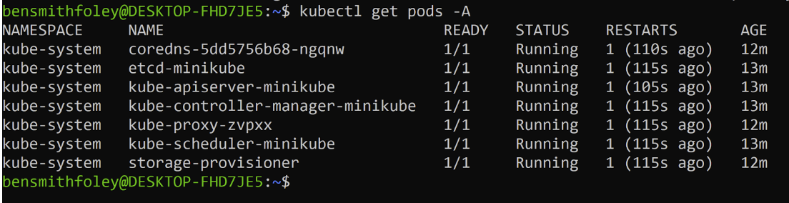

01/23/2024
Feedback from Sean Bentley(Boeing) about things to explore
Test Suite for CNI Plug-in, identify what impacts the plugin with metrics
Extending packet filtering for added observability metrics and packet manipulation for the sidecarless eBPF service mesh
Enabling Multicast
https://www.cloudflare.com/learning/network-layer/what-is-igmp/ 
Tuning for Transient Links
Tunable health checks and L2 announcements via BGP
How does this function with edge nodes?
We were forwarded (2) papers to review that had potential future opportunities to explore:
Automated Threat Modeling
Paper 1:https://www.researchgate.net/profile/Patrick-Kamongi-2/publication/273061698_Nemesis_Automated_Architecture_for_Threat_Modeling_and_Risk_Assessment_for_Cloud_Computing/links/54f617240cf21d8b8a5c1b1c/Nemesis-Automated-Architecture-for-Threat-Modeling-and-Risk-Assessment-for-Cloud-Computing.pdf

Paper 2: https://ieeexplore.ieee.org/abstract/document/6155723

01/26/2024
Sync Call: Attendees: Sam, Ben, Damani
Homework: 
Research on CNI
What is a CNI?
Why is it important?
What is a ServiceMesh
Why is it important?
How does it interact with the CNI?
Who is Isovalent
Why did they create Cilium?
What other products do they offer?
Listen to the podcast ( Cilium and eBPF, with Bill Mulligan)
What did you learn from the podcast?
What things did you research from the podcast?
Look into attending KubeCon NA 2024 in ( Salt Lake City, Utah)
Nov 12-15th 
https://events.linuxfoundation.org/kubecon-cloudnativecon-north-america-2024/
Damani to identify and schedule meetings with Cilium contributors 

01/30/2024
Met in RCOS group - Ben, Sam
Submitted Project Proposal to RCOS
Cilium RCOS Proposal

01/31/2024
Sync Call: Attendees: Ben, Damani, Sean Bentley
Met with Sean Bentley from Boeing
Spoke about Cilium, its purpose, roadmap, ideas
Sean outlined a rough idea of how we can go about starting the project
What to research before we start
Networking
OSI Reference Model
Unicast
Broadcast
Multicast
eBPF
Containers
Docker
Kubernetes
Container Network Interface plugins (CNI)
Calico
Flannel
Weavenet
Cilium
Starting action items (after research)
Stand up a sample Kubernetes cluster on a box
Run some workloads to get our feet wet
Actually run Cilium on the cluster as a CNI plugin
Practice building Cilium images ourselves rather than just pulling the images off docker hub or github or whatever

02/02/2024
Ben Smith-Foley
Class period
Listened to Google Cilium podcast
- Employee of Isovalent
Bill Mulligan
- "App Store" for linux kernel
- began as connectivity layer connecting containers together
  - evolved into security of the microservices
    - evolved into observability if all traffic is over network what happens when things break?
      - Hubble launched, attaches onto Cilium, pulls info off Cilium so you can see a service map, network metrics, have observability
- Multicluster mesh
  - Consistent layer to tie everything together
- CN isn't just about kubernetes, about spreading to things outside of kubernetes as well
  - Service mesh that extends to bare metal servers, VM's, etc.
- Cilium layer 3-4 controlling all network packets all the way to level 7
- Cilium has a playbook similar to ansible, yaml sends eBPF rules
- isovalent top 5 contributer to Cilium but not only one
- New certification from Linux Foundation
  - CCA focused specifically on Cilium
  - Entry level certification on Cilium
    - Part 1
      - Insulation configuration
    - Part 2
      - Architecture
    - Part 3
      - Network Security
    - Part 4
      - Network Observability with Hubble & service mesh & cluster mesh & external networking
  - CCA study guide on Github somewhere (not sure where)
  - Isovalent website has labs with hands on demo environments going through all features about Cilium
Researched Labs discussed in podcast
Isovalent library
Cilium Lab
Probably not worth going and getting a bunch of these certs they aren’t very valuable
The labs though are very valuable just to learn so we should treat them as an opportunity to learn hands on with it instead
Researched eBPF site discussed in podcast
eBPF.io
Got homework list for next week
OSI Model
Basic “___cast networking”
eBPF
Kubernetes
Containers
Weavenet

02/06/2024
Sam Begin
Class Period
Listened to Google Cilium Podcast
EBPf linux kernel technology
Ebpf is to the kernel as java is to webpages
“App store” for linux kernel (add new programs/functions)
EBPf.io (check out)
Speeds up the process of adding new stuff to kernel
Cilium
CNI - a way to connect containers together
How do we secure this? 
What happens when things break
Hubble Launched (attaches onto Cilium and pulls info)
Service maps, network metrics
Cilium service mesh
Originally had 80%ish of a complete structure
connecting/observing
EBPf and Cilium - how are they connected?
Cilium is an extraction layer on EBPf
Allows you to write in yaml
Instead of writing EBPf programs individually
CCA - Cilium Certification (linux foundation)
Insulation Configuration
Architecture
Network Policy
Service Mesh/Network Observability
Cluster mesh/EBPf
Labs on Cilium Website
Definitely Helpful
“World Of Cilium”
Worked on Slideshow
Ben Smith-Foley
Class Period
Setup single-node kubernetes cluster on local machine using WSL & minikube
Steps
Installed Docker
https://download.docker.com/linux/ubuntu
Installed minikube
curl -Lo minikube https://storage.googleapis.com/minikube/releases/latest/minikube-linux-amd64
Make it executable
chmod +x ./minikube
Move it to user’s executable PATH
sudo mv ./minikube /usr/local/bin/
Set driver version to docker
minikube config set driver docker
Installed kubectl
curl -LO "https://dl.k8s.io/release/$(curl -L -s https://dl.k8s.io/release/stable.txt)/bin/linux/amd64/kubectl"
Make it executable
chmod +x ./kubectl
Move it to user’s executable PATH
sudo mv ./kubectl /usr/local/bin/
Minikube start
Setup kubectl to use minikube by default
kubectl config use-context minikube
Restart minikube to start it with kubectl enabled
minikube start
kubectl get pods -A
Should see output

Can now view cluster in dashboard or using CLI
Some useful commands
Minikube profile list
Minikube status
Minikube dashboard
Minikube start
Tried to setup Cilium using WSL
Discovered cannot do it cleanly
A lot of ipv6 config options disabled by default by WSL
While we could go through and enable all of them, that may have future implications on unrelated WSL features I need
Decided I need to deploy an EC2 instance, connect & work there instead of locally
Cilium Setup
Using EC2 instance (EBS volume t2.medium)
Install Docker
Install kubectl
Command line tool to run commands against clusters
Install kubadm
Automatically performs actions needed to get a minimum viable cluster up
Install kubelet
Primary node agent that runs on each node
Install minikube
Lightweight kubernetes that creates a VM on machine and deploys a simple 1 node cluster
Install cilium CLI
Allows for cilium commands to be run on command line
Install cilium

02/09/2024
Attendees: Damani Corbin, Ben Smith-Foley, Sam Begin
Damani spoke to (Liz Rice & Stephen Agustus) about this project while in London
Liz said she would connect us with Bill Mulligan who is leading a lot of the work on their end
Ben connected with Bill Mulligan
Ben successfully deployed single node cluster
Look at possible different methods of deployment?
Tilt.dev (kubernetes management)
See emergent work
Ben suggesting the use of Prometheus/Grafana - Dashboard for de
Evidence that we got eBPF working
Ben suggest Setting up IAC - Infrastructure as Code
Ben suggests Terraform for deploying infrastructure
**This will also assist with cost management, Ben realized how many manual steps were taken to delete the infrastructure so he released he does not want to do that again and he should quickly get Terraform Installed and up and running. 
Ben suggesting utilizing AWS as Cloud Provider because of his familiarity with it and suggested tools
Damani Suggesting we also be prepared to run this On-Prem and not dependant on any cloud
Goal: Ben to become a Cilium Maintainer
What are the steps to become a maintainer
When are we going to try to deploy full structure? 
Start Capturing Costs for this project?
What costs are associated?
What other factors are involved?
Hardware - rent or buy?
Software - which to choose? AWS, etc..
Possibility: AWS - mock billing tool
Damani suggests that we stay away from any cloud
Deploy it ourselves
bensmithfoley@gmail.com , Please add your picture of your Cilium deployment and text that you entered in text message
Ben/Sam to follow up with Damani on Social Media / Communication Strategy 
Ambassadors of RCOS
Damani/Mentor coming on Campus 2/28/2024
Ambassadors of Cilium
Ben - Highlighting things about Boeing
KubeCon 2024 Planning & Posting 

02/13/2024
Sam Begin
Class Period
AWS EKS Single Cluster = $73/month + minimal cost per node
Tilt.dev (opensource)  and EKS seem to do the same thing
Bare Metal: each node requires 100gb-ish of HD and 4gb-ish RAM
Need 4 nodes to test Multicast (2 unicast, 3 would still be broadcast, 4 multicast)
AWS 4 EC2 instances for one year: $98.11 ($24.53 each)
t3.medium ($21.90 per month)
t3.small (*4) + networking + 20GB 
PheonixNap - s0.d1.medium
Single 4-core Intel CPU
32 GB of Ram
1 x 480 GB SSD
2 x 1 Gbps network
10 cents per hour ($72/month)
AWS
On Demand EC2 Instances
4 t3.small (24 hours of usage/week) + 20GB EBS + Network monitoring
17.99 a month
Need some sort of control plane (later issue)

02/27/2024
Sam Begin
Class Period
Worked on “Cilium Journey” slides 
Spoke with Ben about pricing options for kubernetes cluster
AWS - seems like best and most flexible option
On Demand EC2 Instances
4 t3.small (24 hours of usage/week) + 20GB EBS + Network monitoring
17.99 a month
Possibility: RCOS sponsored VM
Could set up cluster? Worth a shot
https://forms.gle/32moejV9rPT3oHNt8

